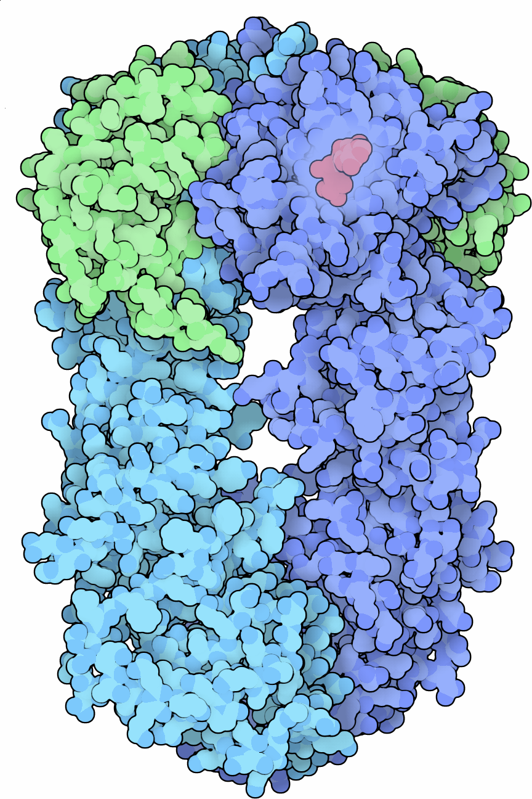

  
  &nbsp;&nbsp;
  

This repository provides a minimal pipeline to process **single-molecule FRET (.tracks/.h5)** data[1] and fit a  
**three-state kinetic model** (Open ↔ Intermediate ↔ Closed) with state-dependent bleaching.

---

## [Documentation](https://bibymaths.github.io/hsp90-smfret-model/)

---

## **References**

[1] Hugel, T. (2025). Datasets for “Single-molecule FRET and tracking of transfected biomolecules in living
cells” [Data set]. Biophysical Journal, 125(March 3), 1–9. Zenodo. https://doi.org/10.5281/zenodo.17559063

[2] **Schrangl, L.**, Göhring, J., Kellner, F., Huppa, J. B., & Schütz, G. J. (2021). *Automated Two-dimensional
Spatiotemporal Analysis of Mobile Single-molecule FRET Probes.* **Journal of Visualized Experiments**, 177,
e63124. [https://doi.org/10.3791/63124](https://doi.org/10.3791/63124)

[3] **Anandamurugan, A.**, Eidloth, A., Frank, V., Wortmann, P., Schrangl, L., Lan, C., Schütz, G. J., & Hugel, T. (
2025). *Single-molecule FRET and tracking of transfected biomolecules in living cells.* **Biophysical Journal**,
S0006-3495(25)00604-6. Advance online
publication. [https://doi.org/10.1016/j.bpj.2025.09.024](https://doi.org/10.1016/j.bpj.2025.09.024)

---

