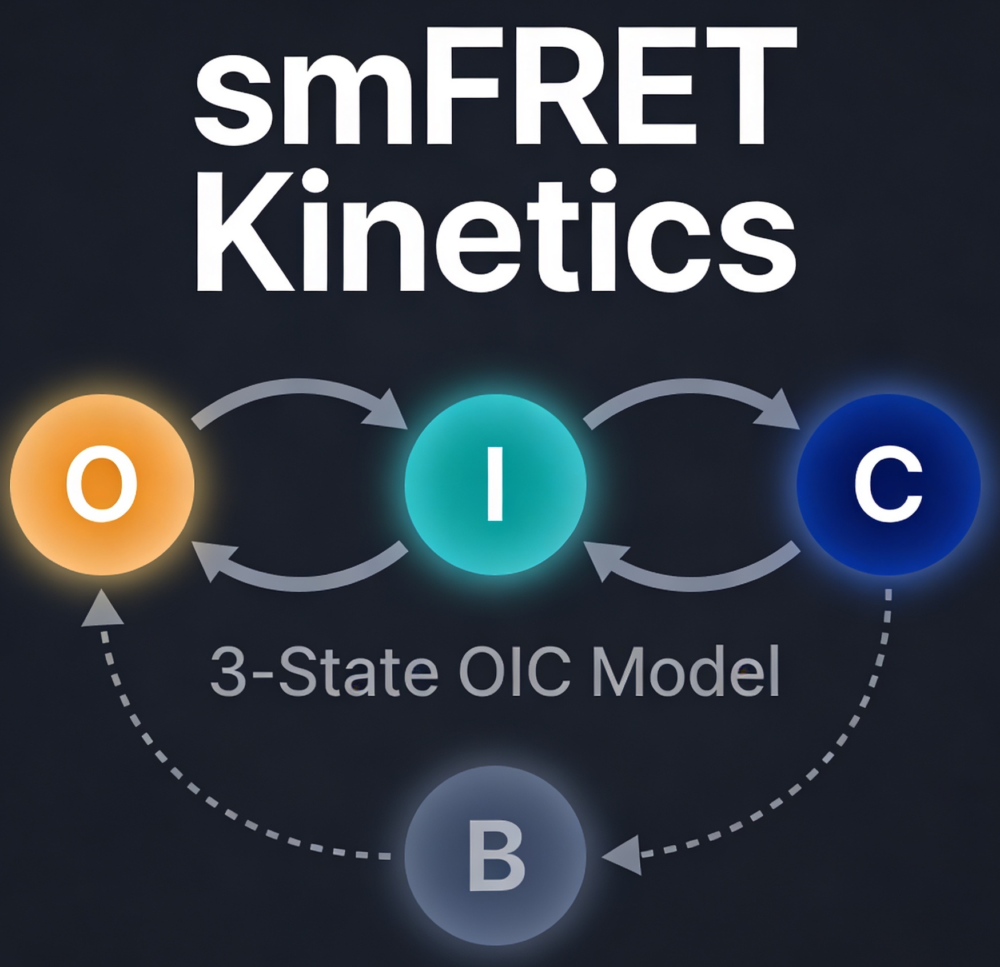

# smFRET Kinetic Model

Three-state OIC kinetic model for single-molecule FRET data with bleaching-aware ensemble fitting.

[](../LICENSE)
[](https://creativecommons.org/licenses/by/4.0/)
[](https://www.python.org/)
[](https://github.com/abhinavmishra/hsp90-smfret-model/actions/workflows/lint.yml)
[](https://github.com/abhinavmishra/hsp90-smfret-model/actions/workflows/tests.yml)
[](https://github.com/abhinavmishra/hsp90-smfret-model/actions/workflows/docs.yml)
[](https://codecov.io/gh/abhinavmishra/hsp90-smfret-model)

<div style="display:flex;gap:24px;align-items:center;">
  
  
</div>

## Quick start

```bash
pip install -e ".[dev,docs]"
python get_traces.py --data-dir data/Hugel_2025 --export-dir data/timeseries
python pipeline.py --outdir results --multistarts 5 --bootstraps 10 --cores 4
```
