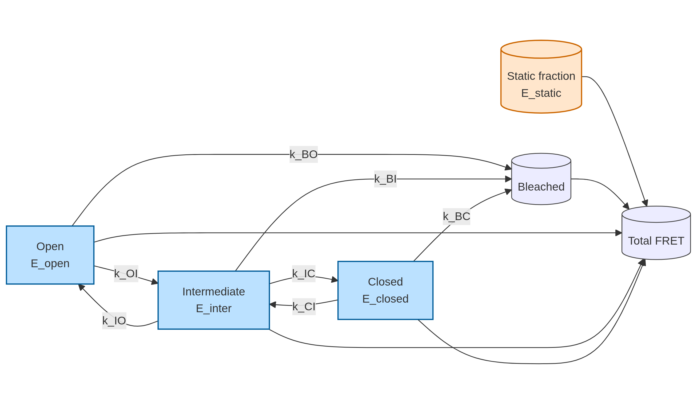
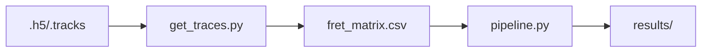

# Overview

smFRET reports nanometer-scale donor/acceptor distance changes in single molecules, enabling direct observation of conformational switching kinetics in living-cell conditions. In this repository, Hsp90 dynamics are represented as a three-state chain: **Open (O)**, **Intermediate (I)**, and **Closed (C)**.

## State topology

## Dynamic + static mixture

The ensemble signal is modeled as a mixture of:

- a **dynamic population** with fraction `f_dyn`, evolving through the O↔I↔C network plus bleaching, and
- a **static population** with fixed FRET level `E_static`.

This separation allows the fit to capture both kinetic transitions and non-switching subpopulations.

## Processing flow

!!! note
    The full analysis depends on the Hügel 2025 dataset (Zenodo DOI: `10.5281/zenodo.17559063`). Place downloaded files in `data/Hugel_2025/` before running the pipeline.
